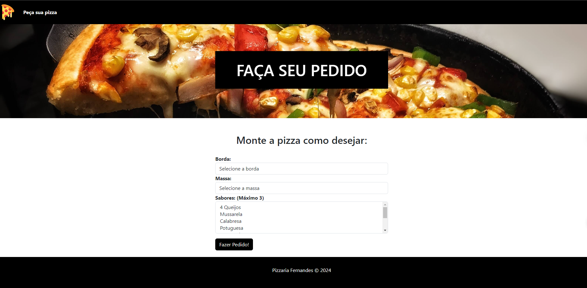

<h1 align="center" style="font-weight: bold;">Project Pizzaria 💻</h1>

    <b>Projeto simples para compra de pizza</b>

<h2 id="layout">🎨 Layout</h2>

    
    

<h2 id="technologies">💻 Technologies</h2>

- php
- mysl
- Css

